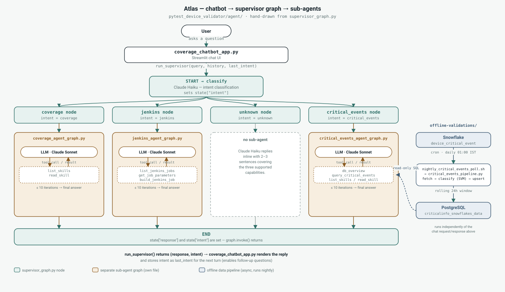

# Atlas Device Agent

## Overview

Atlas is a chat-based assistant for the device-automation test framework. It runs as a
FastAPI service (with a Streamlit chat UI on top) and answers three kinds of questions
by routing them to a dedicated sub-agent, each implemented as its own
[LangGraph](https://langchain-ai.github.io/langgraph/) ReAct loop backed by Claude:

| Intent            | Sub-agent                        | Answers questions about |
|-------------------|----------------------------------|--------------------------|
| `coverage`        | `coverage_agent_graph.py`        | Which skills/testcases cover a feature or flow |
| `jenkins`         | `jenkins_agent_graph.py`         | Triggering/checking Jenkins jobs |
| `critical_events` | `critical_events_agent_graph.py` | Local critical-event DB analytics and trends |
| `unknown`         | handled inline in the supervisor | Anything that doesn't match the above |

A `supervisor_graph.py` sits in front of all three: it classifies the incoming message,
routes it to the right sub-agent, and keeps enough conversation history to support
natural follow-up questions.

## Folder Structure

```
atlas-device-agent/
├── atlas/                          # The service package
│   ├── __main__.py                 #   CLI: python -m atlas serve
│   ├── main.py                     #   Root FastAPI app, mounts the router
│   ├── router.py                   #   /atlas API: sessions, chat, direct sub-agent access, index-stats
│   ├── models.py                   #   Pydantic request/response models
│   ├── session_store.py            #   In-memory chat session history
│   ├── config.py                   #   Repo-root paths + cached prompt loaders
│   ├── supervisor_graph.py         #   LangGraph supervisor — classify → route → sub-agent
│   ├── coverage_agent_graph.py     #   Coverage sub-agent (list_skills / read_skill tools)
│   ├── jenkins_agent_graph.py      #   Jenkins sub-agent (list_jobs / get_parameters / build_job tools)
│   ├── critical_events_agent_graph.py  # Critical-events sub-agent (db_overview / query tools)
│   ├── coverage_chatbot_core.py    #   Loads .agent.md system prompts
│   └── coverage_chatbot_app.py     #   Streamlit UI — thin HTTP client for the API
├── prompts/                        # System prompts (<name>.agent.md) for the three sub-agents
├── skills/                         # Skill namespaces read by the sub-agents
│   ├── cinfo-skills/               #   Used only by critical_events agent
│   └── device-skills/              #   Used only by coverage agent
├── pipeline/                       # Nightly Snowflake → Postgres critical-events pipeline
│   ├── critical_events_pipeline.py #   Pull rolling 24h window, classify (SVM), upsert to Postgres
│   ├── nightly_priority_pipeline.py#   Cluster + prioritize error descriptions
│   ├── nightly_critical_events_poll.sh # Cron entry point (01:00 IST)
│   ├── fetch_device_config.py      #   Postgres/Snowflake connection helpers
│   ├── query_unique_critical_descriptions.py
│   ├── svm_type_classifier.py      #   Train/evaluate the INFO-vs-ERROR classifier
│   └── models/                     #   Trained SVM model + metrics
├── scripts/
│   └── verify_jenkins.py           # Interactive smoke test for the Jenkins agent
├── docs/
│   └── atlas_architecture.svg
├── Dockerfile                      # Deps-only image; repo is bind-mounted at /repo
├── Makefile                        # docker-build / run / detached / logs / stop
├── requirements.txt
├── .env.example                    # → copy to .env and fill in (gitignored)
└── db_credentials.ini.example      # → copy to db_credentials.ini and fill in (gitignored)
```

Not in this repo: the framework's full skill library and `test_cases/` stay in
`device-automation`. Only the critical-errors skills are currently vendored under
`skills/cinfo-skills/`.
Set `DEVICE_AUTOMATION_ROOT` in `.env` to a device-automation checkout if you want the
testcase-count stat in the UI header.

## How It Works — Graph Flowchart



**Key mechanics:**

- **Intent stickiness** — if the classifier returns `unknown` but the previous turn was
  `coverage`/`jenkins`/`critical_events`, the supervisor treats the message as a
  follow-up and keeps the prior intent (`supervisor_graph.py`).
- **History scoping** — conversation history is only forwarded into a sub-agent when the
  intent hasn't changed turn-to-turn; switching topics clears history so a new sub-agent
  doesn't inherit an unrelated conversation (`_relevant_history`).
- **Model split** — `classify` and `unknown` use Claude Haiku (fast/cheap routing); each
  sub-agent's own ReAct loop uses Claude Sonnet (`CLAUDE_MODEL` in `.env`) for the actual
  reasoning and tool use.
- **Critical-events data can come from production or staging** — `critical_events_agent_graph.py`
  runs read-only queries against the local PostgreSQL production table
  `criticalinfo_snowflakes_data`, and can also query Snowflake staging table
  `STAGE_IDMS_MAIN_DB.PUBLIC.DEVICE_CRITICAL_EVENT` for staging or compare asks.
  The local production table is kept fresh by `pipeline/nightly_critical_events_poll.sh`,
  a cron job that runs daily at 01:00 IST, pulls the last rolling 24h window from
  Snowflake (`critical_events_pipeline.py`), classifies each row (INFO/ERROR via SVM),
  and upserts it into Postgres. This pipeline is fully decoupled from the chat
  request/response cycle above it.

## Setup

```bash
cd atlas-device-agent
python3 -m venv .venv && source .venv/bin/activate
pip install -r requirements.txt

cp .env.example .env                                  # fill in keys
cp db_credentials.ini.example db_credentials.ini      # fill in DB creds
```

If you run Atlas in Docker and PostgreSQL on the host machine, set
`host=host.docker.internal` for `IRAVATH_DB` and `POLL_USER_DB` in
`db_credentials.ini`. The provided `make docker-run*` targets already add the
required host-gateway mapping.

For this machine, PostgreSQL is using:
- `/etc/postgresql/12/main/postgresql.conf`
- `/etc/postgresql/12/main/pg_hba.conf`

To allow the container to connect, set `listen_addresses = '*'` in
`/etc/postgresql/12/main/postgresql.conf`, add an allow rule for the Docker
bridge/host-gateway subnet in `/etc/postgresql/12/main/pg_hba.conf`, then run:

```bash
sudo systemctl restart postgresql
```

`ANTHROPIC_API_KEY` is required for all agents. Jenkins questions additionally need
`JENKINS_URL`, `JENKINS_USER`, `JENKINS_API_TOKEN`; critical-events questions need
`db_credentials.ini` at the repo root.

### Run the API

```bash
python -m atlas serve                 # http://localhost:8000, docs at /docs
python -m atlas serve --port 9000 --reload
```

Or in Docker (deps-only image, repo bind-mounted):

```bash
make docker-build-run                 # foreground
make docker-build-run-detached        # background, survives logout
```

### Run the Streamlit UI

```bash
streamlit run atlas/coverage_chatbot_app.py
```

Point it at a non-default API location with `ATLAS_API_URL`.

### Nightly pipeline cron

The nightly poll expects the venv at `.venv/` in the repo root:

```
0 1 * * * /path/to/atlas-device-agent/pipeline/nightly_critical_events_poll.sh
```

## Sample questions

**Coverage**
- "Which test cases cover awsiot shadow sync?"
- "Do we have coverage for network recovery on bagheera?"
- "Which framework skill handles service restart validation?"

**Jenkins**
- "Which Jenkins pipeline is used for nightly validation?"
- "Run the nightly integration job for device 12345"
- "What parameters does the D470 sanity job take?"

**Critical events**
- "Summarize critical events for version 6.15.rc.1"
- "Summarize critical events for version 6.15.rc.1 in staging"
- "Compare staging vs production critical events for version 6.15.rc.1"
- "What are the top error codes in the last day?"
- "Show the error/info split for the connectionmanager service"

**Follow-ups** (same intent, context is kept automatically):
- "Which test cases cover reboot validation?" → "Which of those run in nightly?"

Anything outside these three areas gets a short clarifying response listing what Atlas
can do, rather than a guess.
