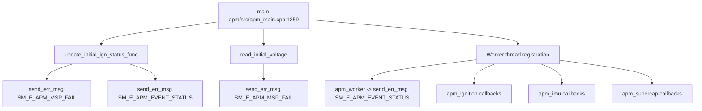

# Incoming Call Tree for apm Startup and Worker Initialization

## Scope

Primary entry:
- apm/src/apm_main.cpp:1259
  - int main()

Key initialization functions:
- apm/src/apm_main.cpp:1143
  - void update_initial_ign_status_func()
- apm/src/apm_main.cpp:1227
  - static void read_initial_voltage()

## Mermaid Flow

## Deterministic Text Call Tree

### Entry

- apm/src/apm_main.cpp:1259
  - int main()

### Startup critical paths

- apm/src/apm_main.cpp:1329
  - GPIO ignition module check -> `SM_E_APM_FILE_OPEN_FAIL`
- apm/src/apm_main.cpp:1337
  - sysfs file open fail -> `SM_E_APM_FILE_OPEN_FAIL`
- apm/src/apm_main.cpp:1382
  - AON read power on/off reason -> `SM_E_APM_MSP_FAIL`
- apm/src/apm_main.cpp:1393
  - IGN_WAKE_UP enable fail -> `SM_E_APM_MSP_FAIL`
- apm/src/apm_main.cpp:1402
  - IGN_WAKE_UP disable fail -> `SM_E_APM_MSP_FAIL`
- apm/src/apm_main.cpp:1412
  - WOM configuration fail -> `SM_E_APM_MSP_FAIL`

### Worker thread critical emitters

Through worker threads spawned in main, emit via:
- apm/src/apm_worker.cpp:136, 205, 210, 615, 627
  - Event status -> `SM_E_APM_EVENT_STATUS`
- apm/src/apm_ignition.cpp:272
  - Ignition glitch -> `SM_E_APM_EVENT_STATUS`
- apm/src/apm_imu.cpp:229
  - IMU glitch -> `SM_E_APM_EVENT_STATUS`
- apm/src/apm_supercap.cpp:518
  - Supercap max event -> `SM_E_APM_SUPERPCAP_STATUS`
