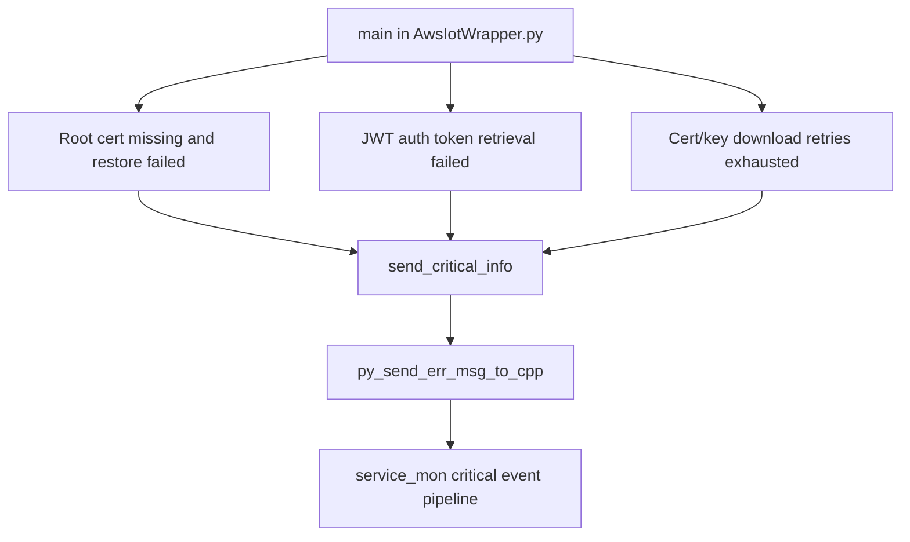

# Incoming Call Tree for send_critical_info (AwsIotWrapper.py)

## Scope

- Function: send_critical_info(error_code, error_msg)
- Definition: awsiot/nd_iot/AwsIotWrapper.py:37

## Mermaid Flow

## Deterministic Text Call Tree

### Target function

- awsiot/nd_iot/AwsIotWrapper.py:37
  - def send_critical_info(error_code, error_msg)

### Direct callers

- awsiot/nd_iot/AwsIotWrapper.py:185
  - root cert missing and backup restore failed
- awsiot/nd_iot/AwsIotWrapper.py:201
  - JWT auth key corruption path
- awsiot/nd_iot/AwsIotWrapper.py:217
  - cert/key download failure after retries

### Parent

- awsiot/nd_iot/AwsIotWrapper.py:88
  - main()

### Sink

- awsiot/nd_iot/AwsIotWrapper.py:43
  - py_send_err_msg_to_cpp(py_to_cpp_obj, error_code, -1, error_msg.encode())
