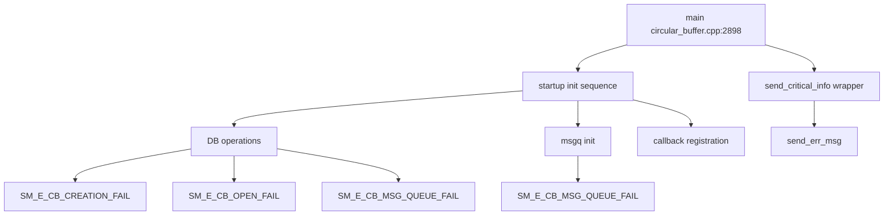

# Incoming Call Tree for Circular Buffer Main and send_critical_info

## Scope

Primary entry:
- circular_buffer/src/circular_buffer.cpp:2898
  - int main(int argc, char *argv[])

Critical info wrapper:
- circular_buffer/src/cirbuf_sqlrequests.cpp:2135
  - void send_critical_info(err_code_t err_code, int aux_code, string err_msg)

## Mermaid Flow

## Deterministic Text Call Tree

### Entry

- circular_buffer/src/circular_buffer.cpp:2898
  - int main(int argc, char *argv[])

### send_critical_info() wrapper function

- circular_buffer/src/cirbuf_sqlrequests.cpp:2135
  - void send_critical_info(...)
- cirbuf_sqlrequests.cpp:2137-2139
  - Rate-limited sender (max MAX_NO_OF_CRITICAL_INFO defined at line 51)
  - Calls `nd_service_obj->send_err_msg(err_code, aux_code, err_msg)`

### Critical sources using send_critical_info

- cirbuf_sqlrequests.cpp:2208
  - `SM_E_CB_FILENAME_WITH_INVALID_CAM_NO`
- cirbuf_sqlrequests.cpp:2230
  - `SM_E_CB_FILESIZE_LESS_THAN_EXPECTED`
- cirbuf_sqlrequests.cpp:2234
  - `SM_E_CB_FILESIZE_MORE_THAN_EXPECTED`
- cirbuf_sqlrequests.cpp:2245
  - `SM_E_CB_INVALID_CAM_TYPE_PRESENT_IN_FILEINFO`
- cirbuf_sqlrequests.cpp:2386
  - `SM_E_CB_QUERY_EXECUTION_FAILED`

### Direct emit sites in main

- circular_buffer.cpp:2906
  - Log init fail -> `SM_E_CB_LOG_INIT_FAIL`
- circular_buffer.cpp:2923
  - msgq fail -> `SM_E_CB_MSG_QUEUE_FAIL`
- circular_buffer.cpp:2963
  - mutex init fail -> `SM_E_CB_MUTEX_INIT_FAIL`
- circular_buffer.cpp:2975
  - DB open fail -> `SM_E_CB_OPEN_FAIL`
- circular_buffer.cpp:2985
  - CB creation fail -> `SM_E_CB_CREATION_FAIL`
