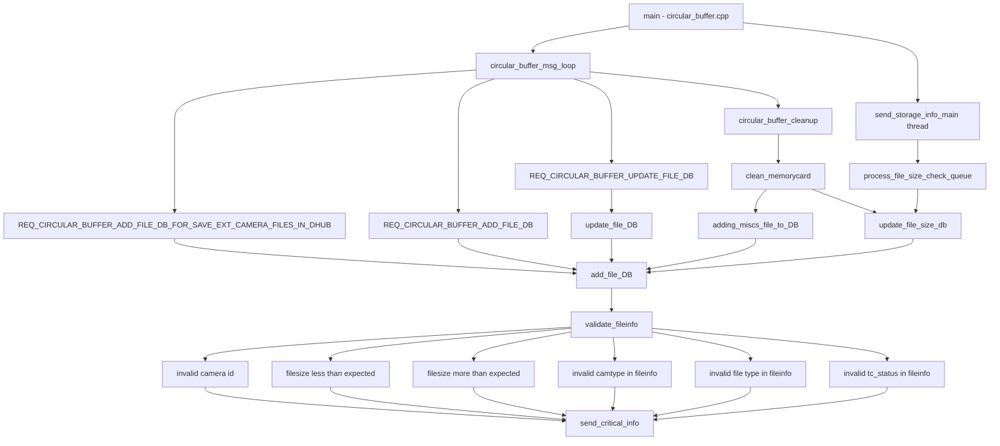

# Incoming Call Tree for send_critical_info (Circular Buffer)

## Scope

This document traces incoming call paths to:

- Function: send_critical_info
- Definition: circular_buffer/src/cirbuf_sqlrequests.cpp:2135

Note:
- This traces the active C++ target function send_critical_info in Circular Buffer.
- A separate Python function with the same name exists in awsiot wrapper code and is not part of this tree.

## Mermaid Flow

## Deterministic Text Call Tree

### Target function

- circular_buffer/src/cirbuf_sqlrequests.cpp:2135
  - void send_critical_info(err_code_t err_code, int aux_code, string err_msg)

### Direct callers of send_critical_info

- circular_buffer/src/cirbuf_sqlrequests.cpp:2208
  - validate_fileinfo -> invalid camera id
- circular_buffer/src/cirbuf_sqlrequests.cpp:2230
  - validate_fileinfo -> file size less than expected
- circular_buffer/src/cirbuf_sqlrequests.cpp:2234
  - validate_fileinfo -> file size more than expected
- circular_buffer/src/cirbuf_sqlrequests.cpp:2245
  - validate_fileinfo -> invalid camtype in fileinfo
- circular_buffer/src/cirbuf_sqlrequests.cpp:2251
  - validate_fileinfo -> invalid file type in fileinfo
- circular_buffer/src/cirbuf_sqlrequests.cpp:2262
  - validate_fileinfo -> invalid tc_status in fileinfo

### Parent of direct callers

- circular_buffer/src/cirbuf_sqlrequests.cpp:2203
  - bool validate_fileinfo(...)
- circular_buffer/src/cirbuf_sqlrequests.cpp:2288
  - validate_fileinfo invoked from add_file_DB(...)
- circular_buffer/src/cirbuf_sqlrequests.cpp:2280
  - bool add_file_DB(...)

### Incoming paths into add_file_DB

Path group A: message loop request handling

- circular_buffer/src/circular_buffer.cpp:2898
  - main(...)
- circular_buffer/src/circular_buffer.cpp:3270
  - main -> circular_buffer_msg_loop()
- circular_buffer/src/circular_buffer.cpp:1574
  - REQ_CIRCULAR_BUFFER_ADD_FILE_DB_FOR_SAVE_EXT_CAMERA_FILES_IN_DHUB -> add_file_DB(...)
- circular_buffer/src/circular_buffer.cpp:1648
  - REQ_CIRCULAR_BUFFER_ADD_FILE_DB -> add_file_DB(...)
- circular_buffer/src/circular_buffer.cpp:1724
  - REQ_CIRCULAR_BUFFER_UPDATE_FILE_DB -> update_file_DB(...)
- circular_buffer/src/circular_buffer.cpp:206
  - update_file_DB -> add_file_DB(...)

Path group B: cleanup/misc ingestion flow

- circular_buffer/src/circular_buffer.cpp:1536
  - REQ_CIRCULAR_BUFFER_CLEAN_DB branch -> circular_buffer_cleanup(...)
- circular_buffer/src/circular_buffer.cpp:2610
  - bool circular_buffer_cleanup(...)
- circular_buffer/src/circular_buffer.cpp:2613
  - circular_buffer_cleanup -> clean_memorycard(...)
- circular_buffer/src/circular_buffer.cpp:2335
  - bool clean_memorycard(...)
- circular_buffer/src/circular_buffer.cpp:2376
  - clean_memorycard -> adding_miscs_file_to_DB(...)
- circular_buffer/src/circular_buffer.cpp:262
  - bool adding_miscs_file_to_DB(...)
- circular_buffer/src/circular_buffer.cpp:420
  - adding_miscs_file_to_DB -> add_file_DB(...)

Path group C: file-size reconciliation flow

- circular_buffer/src/circular_buffer.cpp:1285
  - signal_process_file_size_check(...)
- circular_buffer/src/circular_buffer.cpp:1270
  - send_storage_info_main waits and runs process_file_size_check_queue(...)
- circular_buffer/src/circular_buffer.cpp:1253
  - process_file_size_check_queue -> update_file_size_db(...)
- circular_buffer/src/circular_buffer.cpp:428
  - update_file_size_db -> add_file_DB(...)
- circular_buffer/src/circular_buffer.cpp:2402
  - clean_memorycard can also call update_file_size_db(...)

## Non-active (compile-disabled) note

- circular_buffer/src/cirbuf_sqlrequests.cpp:3386
  - send_critical_info(...) appears in a section guarded under #if 0 in this file region.
  - Treat as non-runtime path in current build unless compile flags change.

## Agent Readability Notes

- Preferred tuple for downstream event analysis: CODE + CODE_AUX + DESCRIPTION + PROCESS.
- Use this call tree to identify which upstream runtime route could have emitted a specific critical event.
- For strongest confidence, pair this tree with timestamp-adjacent logs and request type context.
