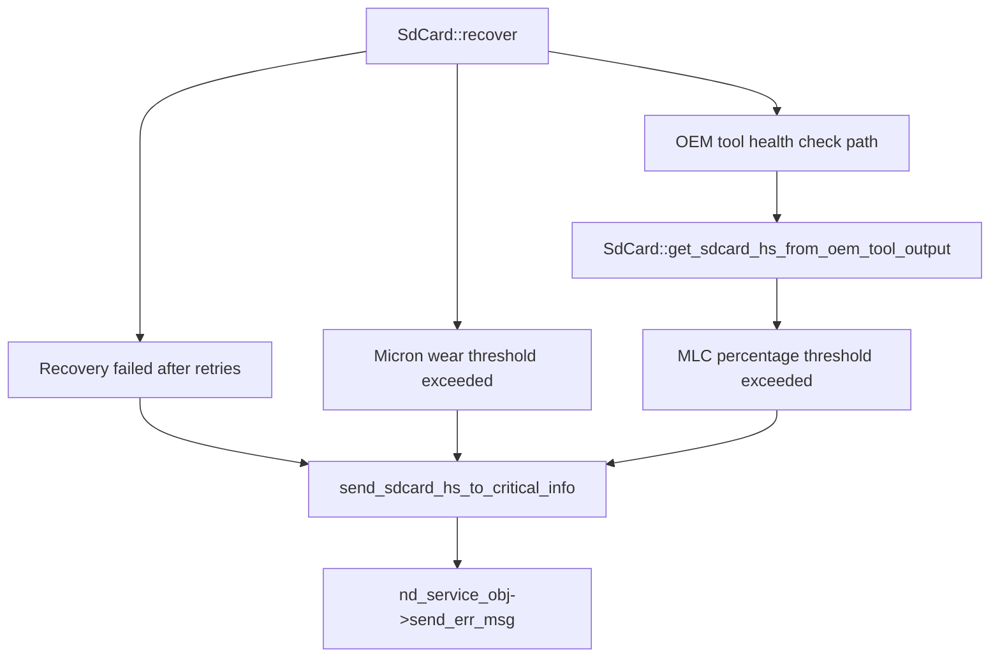

# Incoming Call Tree for SdCard::send_sdcard_hs_to_critical_info (Diagnostic)

## Scope

- Function: SdCard::send_sdcard_hs_to_critical_info
- Definition: diagnostic/src/sdcard.cpp:154

## Mermaid Flow

## Deterministic Text Call Tree

### Target function

- diagnostic/src/sdcard.cpp:154
  - void SdCard::send_sdcard_hs_to_critical_info(enum err_code_t err_code, string msg)

### Direct callers

- diagnostic/src/sdcard.cpp:144
  - SdCard::get_sdcard_hs_from_oem_tool_output(...) -> replace SD card health event
- diagnostic/src/sdcard.cpp:224
  - SdCard::recover() -> replacement required (recovery failed)
- diagnostic/src/sdcard.cpp:250
  - SdCard::recover() -> micron wear threshold path
- diagnostic/src/sdcard.cpp:348
  - SdCard::recover() -> health check path

### Parent relationships

- diagnostic/src/sdcard.cpp:85
  - bool SdCard::get_sdcard_hs_from_oem_tool_output(storage_type st_type)
- diagnostic/src/sdcard.cpp:166
  - void SdCard::recover()

### Sink

- diagnostic/src/sdcard.cpp:159
- diagnostic/src/sdcard.cpp:163
  - send_sdcard_hs_to_critical_info -> nd_service_obj->send_err_msg(...)
