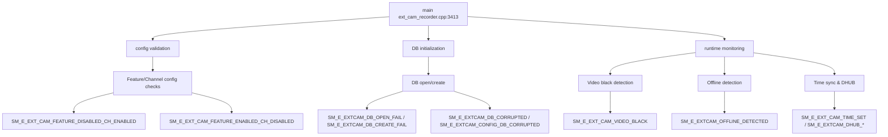

# Incoming Call Tree for Exterior Camera Recorder Main

## Scope

Primary entry:
- ext_cam/src/ext_cam_recorder.cpp:3413
  - int main(int argc, char *argv[])

## Mermaid Flow

## Deterministic Text Call Tree

### Entry

- ext_cam/src/ext_cam_recorder.cpp:3413
  - int main(int argc, char *argv[])

### Configuration validation at startup

- ext_cam_recorder.cpp:3461
  - Feature disabled but channels enabled -> `SM_E_EXT_CAM_FEATURE_DISABLED_CH_ENABLED`
- ext_cam_recorder.cpp:3468
  - Feature enabled but channels disabled -> `SM_E_EXT_CAM_FEATURE_ENABLED_CH_DISABLED`

### Database initialization

- ext_cam_recorder.cpp:3554
  - DB corrupted -> `SM_E_EXTCAM_DB_CORRUPTED`
- ext_cam_recorder.cpp:3566
  - DB create fail -> `SM_E_EXTCAM_DB_CREATE_FAIL`
- ext_cam_recorder.cpp:3587
  - DB open fail -> `SM_E_EXTCAM_DB_OPEN_FAIL`
- ext_cam_recorder.cpp:3606
  - VOD cleanup fail -> `SM_E_EXTCAM_CLEANUP_FAIL`

### Runtime monitoring paths

**Video quality detection:**
- ext_cam_recorder.cpp:2530, 2533, 2536, 2539
  - Video black frame detected -> `SM_E_EXT_CAM_VIDEO_BLACK`

**Camera connectivity:**
- ext_cam_recorder.cpp:1095
  - Camera offline detected -> `SM_E_EXTCAM_OFFLINE_DETECTED`
- ext_cam_recorder.cpp:1018
  - Auto config scan -> `SM_E_EXTCAM_AUTO_CONFIGURE_SCAN`

**Time synchronization:**
- ext_cam_recorder.cpp:923
  - Time set success -> `SM_E_EXT_CAM_TIME_SET`
- ext_cam_recorder.cpp:927, 931
  - Time set fail -> `SM_E_EXT_CAM_TIME_SET_FAIL`

**DHUB integration:**
- ext_cam_recorder.cpp:3850
  - VBUS enabled but DHUB not supported -> `SM_E_EXT_CAM_IOSIX_DHUB_GEN2`
- ext_cam_recorder.cpp:4000
  - DHUB disk error -> `SM_E_EXT_CAM_DHUB_DISK_ERR`
- ext_cam_recorder.cpp:4011
  - DHUB format fail -> `SM_E_EXT_CAM_DHUB_FORMAT`
- ext_cam_recorder.cpp:3693
  - DHUB pulling videos -> `SM_E_EXT_CAM_DHUBX_PULLING_VIDEOS`

**Storage limits:**
- ext_cam_recorder.cpp:3655
  - DB limit reached -> `SM_E_EXT_CAM_DB_LIMIT`
