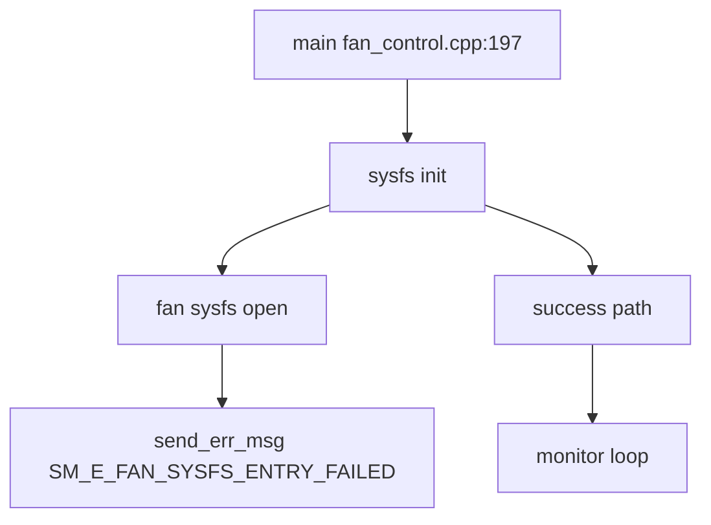

# Incoming Call Tree for Fan Control Main

## Scope

Primary entry:
- fan_control/src/fan_control.cpp:197
  - int main(int argc, char *argv[])

## Mermaid Flow

## Deterministic Text Call Tree

### Entry

- fan_control/src/fan_control.cpp:197
  - int main(int argc, char *argv[])

### Critical emission point

- fan_control.cpp:229
  - Fan sysfs file open fail -> `SM_E_FAN_SYSFS_ENTRY_FAILED`
