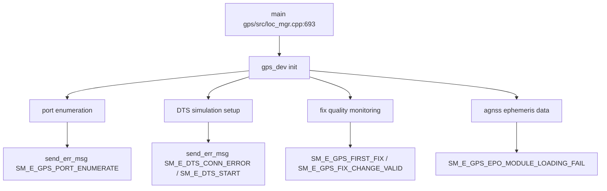

# Incoming Call Tree for GPS Location Manager Main

## Scope

Primary entry:
- gps/src/loc_mgr.cpp:693
  - int main()

## Mermaid Flow

## Deterministic Text Call Tree

### Entry

- gps/src/loc_mgr.cpp:693
  - int main()

### Initialization critical paths

- gps/src/loc_mgr.cpp:743
  - GPS refresh rate config -> `SM_E_NDC_GPS_FAIL`
- gps/src/gps_dev.cpp:1901
  - Port enumeration fail -> `SM_E_GPS_PORT_ENUMERATE`
- gps/src/agnss.cpp:359
  - EPO module loading fail -> `SM_E_GPS_EPO_MODULE_LOADING_FAIL`

### DTS simulation paths

- gps/src/loc_mgr.cpp:540
  - DTS GPS simulation start -> `SM_E_DTS_START`
- gps/src/loc_mgr.cpp:650
  - DTS socket creation error -> `SM_E_DTS_CONN_ERROR`
- gps/src/loc_mgr.cpp:656
  - DTS bind/listen error -> `SM_E_DTS_CONN_ERROR`
- gps/src/loc_mgr.cpp:687
  - DTS connection error -> `SM_E_DTS_CONN_ERROR`

### Fix quality emission

- gps/src/gps_dev.cpp:552
  - First fix acquired -> `SM_E_GPS_FIRST_FIX`
- gps/src/gps_dev.cpp:1313
  - First fix (session record) -> `SM_E_GPS_FIRST_FIX`
- gps/src/gps_dev.cpp:1330
  - Fix change (valid) -> `SM_E_GPS_FIX_CHANGE_VALID`
- gps/src/gps_dev.cpp:1340
  - Fix change (invalid) -> `SM_E_GPS_FIX_CHANGE_INVALID`
- gps/src/gps_dev.cpp:1882
  - Last valid GPS info -> `SM_E_GPS_LAST_VALID_GPS_INFO`
- gps/src/loc_mgr.cpp:354
  - Fix state change (monitoring) -> `SM_E_GPS_FIX_CHANGE_STATE`
