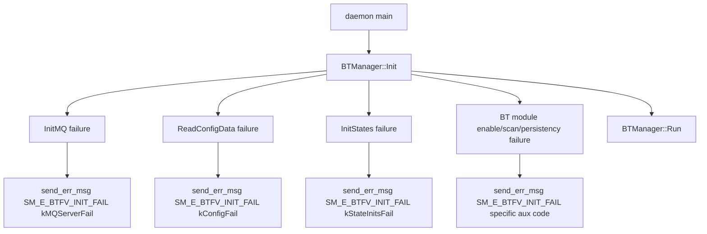

# Incoming Call Tree for BTManager::Init (nd_bt daemon)

## Scope

- Function: bool BTManager::Init()
- Definition: nd_bt/src/daemon/nd_bt_man.cpp:2172

## Mermaid Flow

## Deterministic Text Call Tree

### Target function

- nd_bt/src/daemon/nd_bt_man.cpp:2172
  - bool BTManager::Init()

### Direct caller

- nd_bt/src/daemon/main.cpp:28
  - daemon `main()` invokes `bt_man_ptr->Init()`

### Representative sink paths inside target

- nd_bt/src/daemon/nd_bt_man.cpp:2212
  - MQ init failure -> `SM_E_BTFV_INIT_FAIL` (aux: `kMQServerFail`)
- nd_bt/src/daemon/nd_bt_man.cpp:2221
  - config read failure -> `SM_E_BTFV_INIT_FAIL` (aux: `kConfigFail`)
- nd_bt/src/daemon/nd_bt_man.cpp:2230
  - state init failure -> `SM_E_BTFV_INIT_FAIL` (aux: `kStateInitsFail`)
- nd_bt/src/daemon/nd_bt_man.cpp:2408
- nd_bt/src/daemon/nd_bt_man.cpp:2418
- nd_bt/src/daemon/nd_bt_man.cpp:2431
  - module/scan/persistency failures -> `SM_E_BTFV_INIT_FAIL`

### Downstream transition

- nd_bt/src/daemon/main.cpp:30
  - on successful init, daemon proceeds to `bt_man_ptr->Run()`
