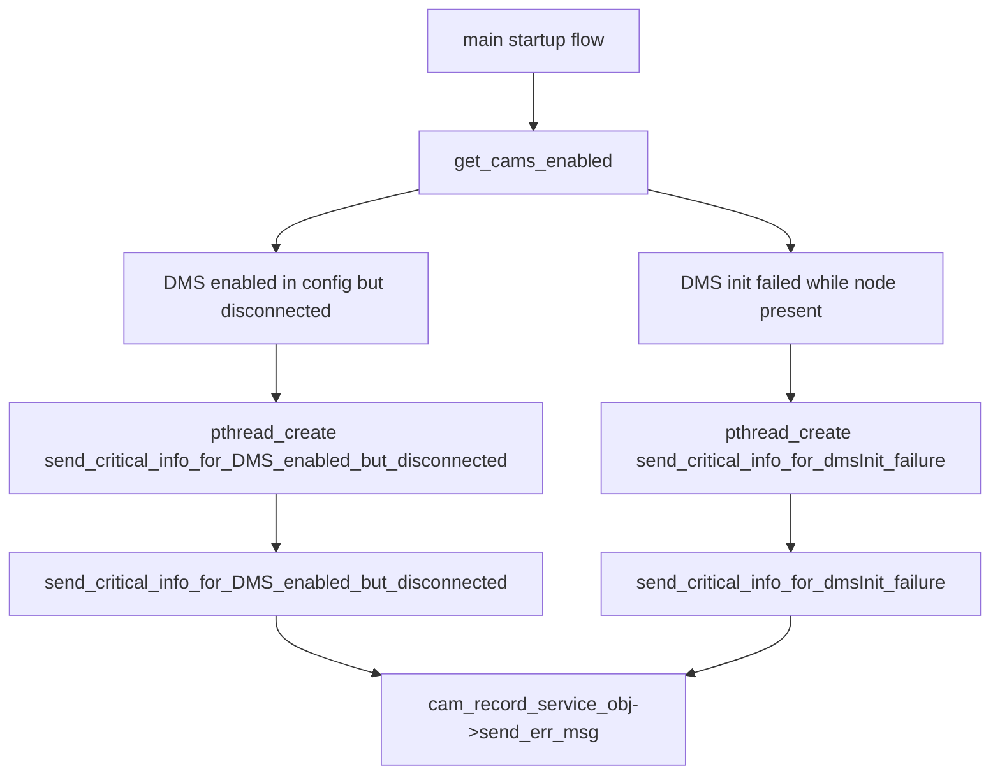

# Incoming Call Tree for DMS Critical-Info Sender Threads (nd-cam_recorder)

## Scope

Target functions:

- nd-cam_recorder/src/cam_recorder.cpp:5358
  - void* send_critical_info_for_DMS_enabled_but_disconnected(void* arg)
- nd-cam_recorder/src/cam_recorder.cpp:5379
  - void* send_critical_info_for_dmsInit_failure(void* arg)

## Mermaid Flow

## Deterministic Text Call Tree

### Direct caller creation points

- nd-cam_recorder/src/cam_recorder.cpp:5512
  - pthread_create(..., send_critical_info_for_DMS_enabled_but_disconnected, ...)
- nd-cam_recorder/src/cam_recorder.cpp:5533
  - pthread_create(..., send_critical_info_for_dmsInit_failure, ...)

### Parent function

- nd-cam_recorder/src/cam_recorder.cpp:5401
  - static bool get_cams_enabled()

### Upstream entry in startup flow

- nd-cam_recorder/src/cam_recorder.cpp:5633
  - get_cams_enabled() invoked in initialization sequence

### Sink

- nd-cam_recorder/src/cam_recorder.cpp:5363
  - send_critical_info_for_DMS_enabled_but_disconnected -> cam_record_service_obj->send_err_msg(...)
- nd-cam_recorder/src/cam_recorder.cpp:5384
  - send_critical_info_for_dmsInit_failure -> cam_record_service_obj->send_err_msg(...)
