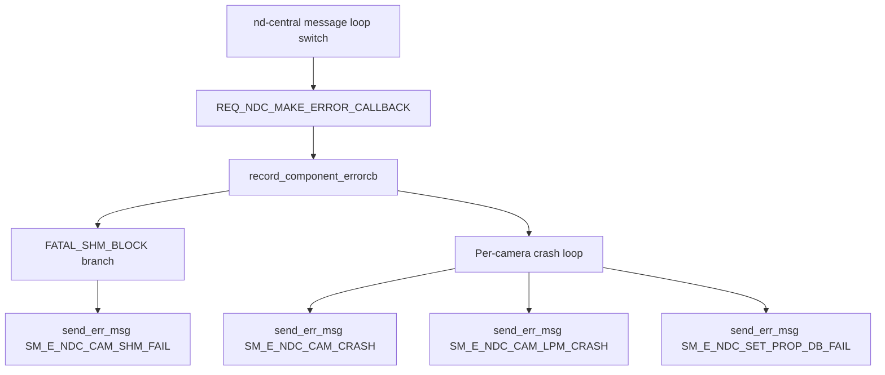

# Incoming Call Tree for record_component_errorcb (nd-central)

## Scope

- Function: record_component_errorcb(component_error_t error, void *crash_status)
- Definition: nd-central/common/central/nd_central.cpp:2886

## Mermaid Flow

## Deterministic Text Call Tree

### Target function

- nd-central/common/central/nd_central.cpp:2886
  - void record_component_errorcb(component_error_t error, void *crash_status)

### Direct caller

- nd-central/common/central/nd_central.cpp:11354
  - message-switch case `REQ_NDC_MAKE_ERROR_CALLBACK` calls `record_component_errorcb(...)`

### Critical sink paths inside target

- nd-central/common/central/nd_central.cpp:2935
  - SHM block path -> `SM_E_NDC_CAM_SHM_FAIL`
- nd-central/common/central/nd_central.cpp:2952
- nd-central/common/central/nd_central.cpp:2955
- nd-central/common/central/nd_central.cpp:2962
- nd-central/common/central/nd_central.cpp:2965
- nd-central/common/central/nd_central.cpp:2969
  - camera crash paths -> `SM_E_NDC_CAM_LPM_CRASH` / `SM_E_NDC_CAM_CRASH`
- nd-central/common/central/nd_central.cpp:2987
- nd-central/common/central/nd_central.cpp:3007
  - DB update failure path -> `SM_E_NDC_SET_PROP_DB_FAIL`
