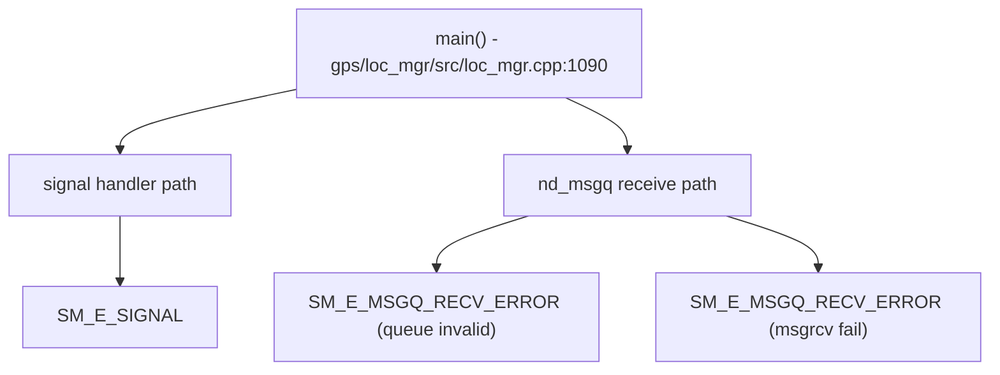

# Incoming Call Tree for GPS loc_mgr Critical Info

## Scope

Primary entry:
- gps/loc_mgr/src/loc_mgr.cpp:1090
  - int main(int argc, char* argv[])

Critical emit sources in this repo slice are infrastructure-level:
- gps/loc_mgr/src/service_utils.cpp
- gps/loc_mgr/src/nd_msgq.cpp

## Mermaid Flow

## Deterministic Text Call Tree

### Signal path

- service_utils.cpp:81 -> `SM_E_SIGNAL` (linux signal, includes tid)

### Message queue path

- nd_msgq.cpp:232 -> `SM_E_MSGQ_RECV_ERROR` (queue not initialized)
- nd_msgq.cpp:245 -> `SM_E_MSGQ_RECV_ERROR` (msgrcv failure)
