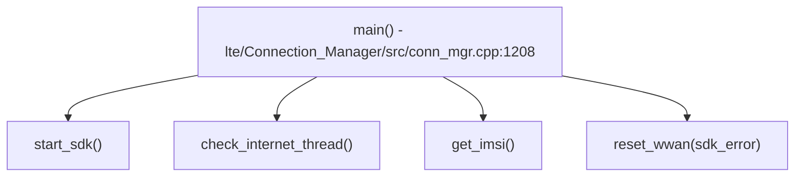

# Incoming Call Tree for LTE Connection Manager Critical Info

## Scope

Primary entry:
- lte/Connection_Manager/src/conn_mgr.cpp:1208
  - int main(int argc, char* argv[])

Additional callback root:
- lte/Connection_Manager/src/conn_mgr_cbk.cpp:173
  - LURejectCallback()

## Mermaid Flow

## Deterministic Text Call Tree

### SDK enumeration and startup

- conn_mgr.cpp:671 -> `SM_E_CONN_MGR_MODEM_RESET`
- conn_mgr.cpp:678 -> `SM_E_CONN_MGR_EXIT` (enumeration failed)
- conn_mgr.cpp:685 -> `SM_E_CONN_MGR_EXIT` (module disconnected)

### Runtime internet and modem control

- conn_mgr.cpp:1922 -> `SM_E_CONN_MGR_MODEM_RESET` (internet down, soft reset)
- conn_mgr.cpp:1927 -> `SM_E_CONN_MGR_EXIT` (internet down, restart app)

### SIM and SDK error handling

- conn_mgr.cpp:1995 -> `SM_E_CONN_MGR_SIM_DETECT`
- conn_mgr.cpp:2001 -> `SM_E_CONN_MGR_SDK_ERROR`
- conn_mgr.cpp:2576 -> `SM_E_CONN_MGR_MODEM_RESET` (sdk hard reset list)
- conn_mgr.cpp:2585 -> `SM_E_CONN_MGR_EXIT`
- conn_mgr.cpp:2593 -> `SM_E_CONN_MGR_SDK_ERROR`

### Callback and infrastructure

- conn_mgr_cbk.cpp:173 -> `SM_E_CONN_MGR_REJECT_CAUSE`
- conn_mgr.cpp:1459 -> `SM_E_CONN_MGR_AMSS_VERSION`
- service_utils.cpp:107 -> `SM_E_SIGNAL`
- nd_msgq.cpp:235,249 -> `SM_E_MSGQ_RECV_ERROR`
