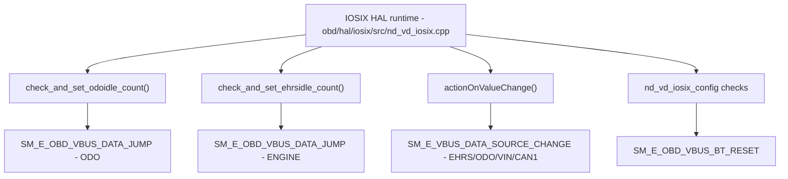

# Incoming Call Tree for IOSIX HAL Critical Info

## Scope

Primary runtime root:
- obd/hal/iosix/src/nd_vd_iosix.cpp

Additional roots:
- obd/hal/iosix/src/nd_vd_iosix_config.cpp
- obd/hal/iosix/src/SourceCmdParser.cpp

## Mermaid Flow

## Deterministic Text Call Tree

### Jump/Buffer/SetCmd Paths (nd_vd_iosix.cpp)

- nd_vd_iosix.cpp:534 -> `SM_E_OBD_VBUS_DATA_JUMP` (ODO jump)
- nd_vd_iosix.cpp:566 -> `SM_E_OBD_VBUS_DATA_JUMP` (Engine hours jump)
- nd_vd_iosix.cpp:652 -> `SM_E_VBUS_CRITICAL_INFO_BUFFER_LENGTH`
- nd_vd_iosix.cpp:683 / 2486 -> `SM_E_OBD_VBUS_SETODO`

### Source-change Paths (SourceCmdParser.cpp)

- SourceCmdParser.cpp:331 -> `SM_E_VBUS_DATA_SOURCE_CHANGE` (EHRS)
- SourceCmdParser.cpp:334 -> `SM_E_VBUS_DATA_SOURCE_CHANGE` (ODO)
- SourceCmdParser.cpp:337 -> `SM_E_VBUS_DATA_SOURCE_CHANGE` (VIN)
- SourceCmdParser.cpp:340 -> `SM_E_VBUS_DATA_SOURCE_CHANGE` (CAN1 Error)
- SourceCmdParser.cpp:343 -> `SM_E_VBUS_DATA_SOURCE_CHANGE` (CAN1 Baud)

### IOSIX config and connectivity paths (nd_vd_iosix_config.cpp)

- nd_vd_iosix_config.cpp:842 -> `SM_E_OBD_VBUS_BT_RESET`
- nd_vd_iosix_config.cpp:936 -> `SM_E_OBD_IOSIX_SSID_ERROR`
- nd_vd_iosix_config.cpp:1307 -> `SM_E_OBD_IOSIX_CONNECTION_ERROR`

### Protocol and telemetry paths (nd_vd_iosix.cpp)

- nd_vd_iosix.cpp:1554 -> `SM_E_VBUS_EVENT_NEWVIN`
- nd_vd_iosix.cpp:1654/1659/1664 -> `SM_E_VBUS_INTEGRATED_PROTOCOL`
- nd_vd_iosix.cpp:1964 -> `SM_E_OBD_VBUS_TIME_MISMATCH`
- nd_vd_iosix.cpp:2248 -> `SM_E_VBUS_VBUS_DATE_TIME_EMPTY`
- nd_vd_iosix.cpp:2340 -> `SM_E_OBD_VBUS_ENGINE_STATE`
- nd_vd_iosix.cpp:3294/3759/3774 -> `SM_E_VBUS_BUFFER_RECORD_ERROR`
- nd_vd_iosix.cpp:3361/3404 -> `SM_E_VBUS_ENCRYPTION`
- nd_vd_iosix.cpp:3574 -> `SM_E_VBUS_ROP_DURATION`
- nd_vd_iosix.cpp:4004/4013 -> `SM_E_VBUS_OBD_PROP_PASS` / `SM_E_VBUS_OBD_PROP_FAIL`
