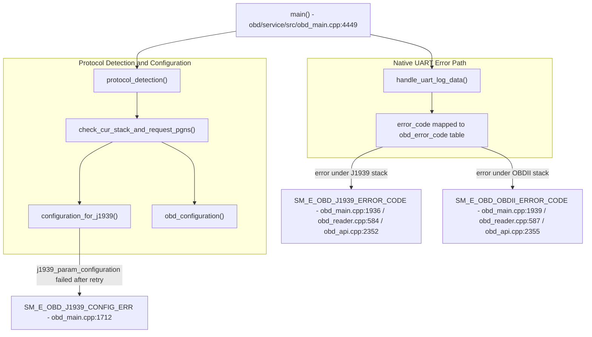

# Incoming Call Tree for OBD Service Critical Info

## Scope

Primary entry:
- obd/service/src/obd_main.cpp:4449
  - int main(int argc, char *argv[])

Additional emit roots:
- obd/service/src/obd_reader.cpp
- obd/service/src/obd_api.cpp
- obd/service/src/obd_eld_vh.cpp

## Mermaid Flow

## Deterministic Text Call Tree

### Startup and Protocol Paths

- obd_main.cpp:1595 -> `SM_E_OBD_STACK_INIT_ERR`
- obd_main.cpp:1609 -> `SM_E_OBD_CAN_DETECT_ERR`
- obd_main.cpp:1624 -> `SM_E_OBD_STACK_DETECT_ERR`
- obd_main.cpp:1712 -> `SM_E_OBD_J1939_CONFIG_ERR`
- obd_main.cpp:1750/1758/1769/1783 -> `SM_E_OBD_OBDII_CONFIG_ERR` (FAST/MED/SLOW/PROP)

### Runtime Error and Data Integrity Paths

- obd_main.cpp:1936 / obd_reader.cpp:584 / obd_api.cpp:2352 -> `SM_E_OBD_J1939_ERROR_CODE`
- obd_main.cpp:1939 / obd_reader.cpp:587 / obd_api.cpp:2355 -> `SM_E_OBD_OBDII_ERROR_CODE`
- obd_api.cpp:2377 -> `SM_E_OBD_INVALID_DATA`
- obd_reader.cpp:847 -> `SM_E_OBD_ODO_JUMP`
- obd_reader.cpp:878 -> `SM_E_OBD_EHRS_JUMP`
- obd_reader.cpp:1682 -> `SM_E_OBD_VIN_MISMATCH`

### Connectivity and FW Paths

- obd_main.cpp:3790 / 3813 -> `SM_E_OBD_IOSIX_CONNECTION_ERROR`
- obd_main.cpp:3824 / 4256 -> `SM_E_OBD_IOSIX_CONNECTED_CLIENT_MODE`
- obd_main.cpp:2483 / 3901 -> `SM_E_OBD_FW_MISMATCH`

### Additional Emitters

- obd_main.cpp:532 -> `SM_E_OBD_PARTITION_ERR`
- obd_main.cpp:1188 -> `SM_E_OBD_ERROR_CODE`
- obd_main.cpp:2396 -> `SM_E_OBD_ADC_ERROR_CODE`
- obd_main.cpp:2463 -> `SM_E_OBD_CABLE_SWAPPED`
- obd_eld_vh.cpp:366 -> `SM_E_OBD_ELD_DB_CREATE_FAIL`
