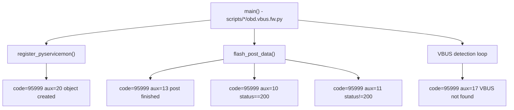

# Incoming Call Tree for VBUS FW Flash Python Script Critical Info

## Scope

Representative script entries (same pattern per platform):
- scripts/krait/obd.vbus.fw.py
- scripts/krait2/obd.vbus.fw.py
- scripts/bagheera2/obd.vbus.fw.py
- scripts/bagheera3/obd.vbus.fw.py

Entry point:
- if __name__ == "__main__": main(deviceid, py_to_cpp_obj)

## Mermaid Flow

## Deterministic Text Call Tree

### Wrapper and emit function

- obd.vbus.fw.py: `post_critical_event(py_to_cpp_obj, crit_msg, aux_code)`
- Calls: `py_service_mon.PY_Class_PY_TO_CPP.py_send_err_msg_to_cpp(py_to_cpp_obj, 95999, aux_code, byte_crit_msg)`

### Emission paths

- object creation: aux=20, "VBUS_FW_FLASH object created"
- post finished: aux=13
- upload success: aux=10
- upload fail HTTP status: aux=11
- latest FW already present: aux=11
- VBUS not found after retries: aux=17
