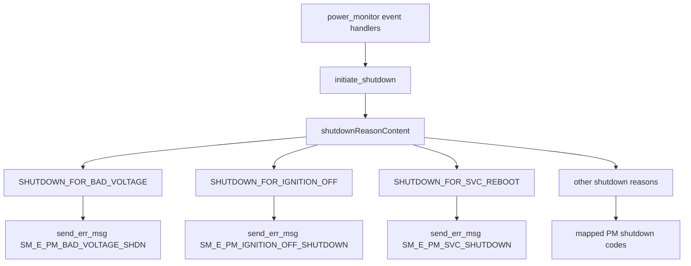

# Incoming Call Tree for shutdownReasonContent (power_monitor)

## Scope

- Function: shutdownReasonContent(..., power_monitor_shutdown_reason reason, ...)
- Definition: power_monitor/src/power_monitor.cpp:2668

## Mermaid Flow

## Deterministic Text Call Tree

### Target function

- power_monitor/src/power_monitor.cpp:2668
  - void shutdownReasonContent(...)

### Direct caller

- power_monitor/src/power_monitor.cpp:2863
  - bool initiate_shutdown(int shutdown_after_secs, power_monitor_shutdown_reason reason)
- power_monitor/src/power_monitor.cpp:2913
  - `initiate_shutdown` calls `shutdownReasonContent(...)`

### Representative upstream callers of `initiate_shutdown`

- power_monitor/src/power_monitor.cpp:3334
  - low-power wakeup path
- power_monitor/src/power_monitor.cpp:3975
  - bad-battery shutdown path
- power_monitor/src/power_monitor.cpp:4023
  - SVC reboot request path
- power_monitor/src/power_monitor.cpp:4155
  - AWSIOT-triggered shutdown path

### Sink examples inside target

- power_monitor/src/power_monitor.cpp:2685
  - `SM_E_PM_BAD_VOLTAGE_SHDN`
- power_monitor/src/power_monitor.cpp:2705
  - `SM_E_PM_IGNITION_OFF_SHUTDOWN`
- power_monitor/src/power_monitor.cpp:2765
  - `SM_E_PM_SVC_SHUTDOWN`
- power_monitor/src/power_monitor.cpp:2841
  - `SM_E_PM_UNKNOWN_INIT_SHDN`
