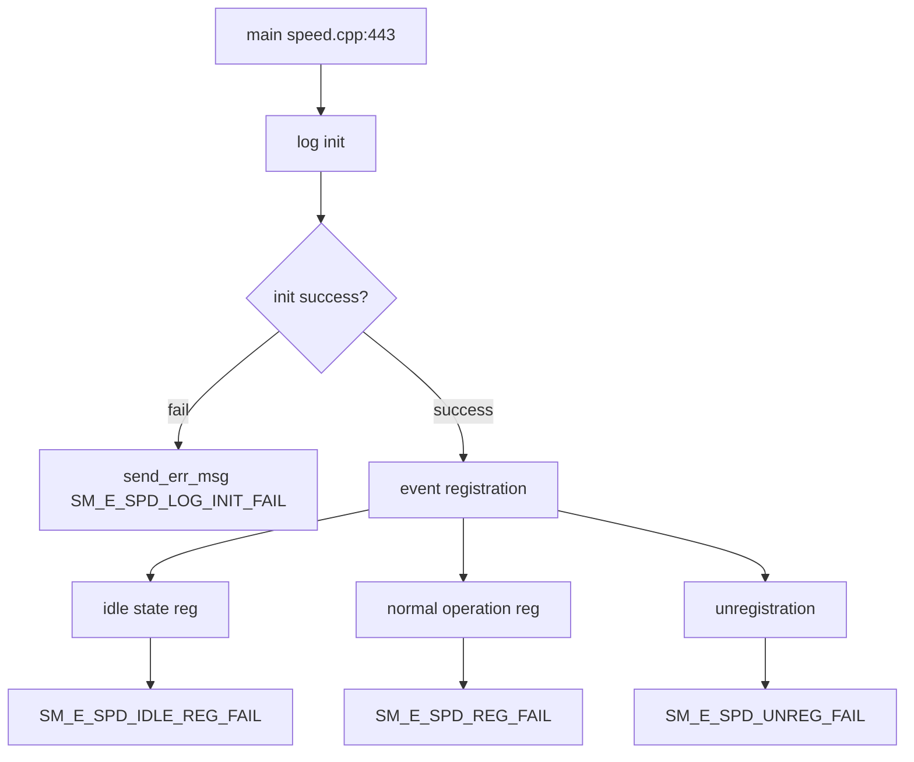

# Incoming Call Tree for Speed Monitoring Main

## Scope

Primary entry:
- speed/src/speed.cpp:443
  - int main()

## Mermaid Flow

## Deterministic Text Call Tree

### Entry

- speed/src/speed.cpp:443
  - int main()

### Startup critical paths

- speed.cpp:449
  - Log init fail -> `SM_E_SPD_LOG_INIT_FAIL`

### Event registration critical points

- speed.cpp:542
  - Normal operation registration fail -> `SM_E_SPD_REG_FAIL`
- speed.cpp:591
  - Unregistration fail -> `SM_E_SPD_UNREG_FAIL`

### Idle state operations

- speed.cpp:622
  - Idle state registration fail -> `SM_E_SPD_IDLE_REG_FAIL`
- speed.cpp:681
  - Idle state unregistration fail -> `SM_E_SPD_UNREG_FAIL`
