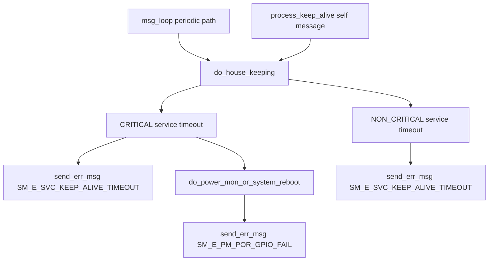

# Incoming Call Tree for do_house_keeping (svc)

## Scope

- Function: do_house_keeping()
- Definition: svc/src/svc.cpp:368

## Mermaid Flow

## Deterministic Text Call Tree

### Target function

- svc/src/svc.cpp:368
  - static void do_house_keeping()

### Direct callers

- svc/src/svc.cpp:509
  - `process_keep_alive()` self keepalive message path
- svc/src/svc.cpp:818
  - `msg_loop()` periodic fallback path when svc utils/msgq init fails

### Critical sink paths

- svc/src/svc.cpp:400
  - CRITICAL service timeout -> `SM_E_SVC_KEEP_ALIVE_TIMEOUT`
- svc/src/svc.cpp:406
  - NON_CRITICAL service timeout -> `SM_E_SVC_KEEP_ALIVE_TIMEOUT`
- svc/src/svc.cpp:360
  - reboot fallback path emits `SM_E_PM_POR_GPIO_FAIL`
