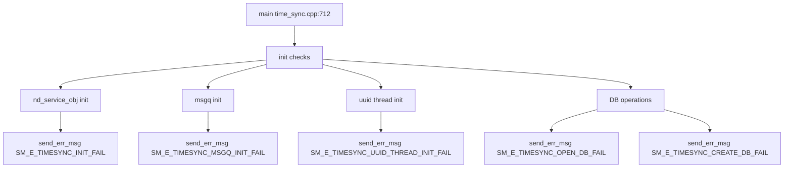

# Incoming Call Tree for Time Sync Main Init

## Scope

Primary entry:
- time_sync/src/time_sync.cpp:712
  - int main(int argc, char **argv)

## Mermaid Flow

## Deterministic Text Call Tree

### Entry

- time_sync/src/time_sync.cpp:712
  - int main(int argc, char **argv)

### Startup critical emission points

- time_sync.cpp:722
  - Service obj init fail -> `SM_E_TIMESYNC_INIT_FAIL`
- time_sync.cpp:744
  - msgq init fail -> `SM_E_TIMESYNC_MSGQ_INIT_FAIL`
- time_sync.cpp:753
  - UUID thread init fail -> `SM_E_TIMESYNC_UUID_THREAD_INIT_FAIL`
- time_sync/src/udid.cpp:133
  - DB open fail (old DB) -> `SM_E_TIMESYNC_OPEN_DB_FAIL`
- time_sync/src/udid.cpp:152
  - DB open fail (new DB) -> `SM_E_TIMESYNC_OPEN_DB_FAIL`
- time_sync/src/udid.cpp:168
  - DB create fail -> `SM_E_TIMESYNC_CREATE_DB_FAIL`

### Runtime emission

- time_sync.cpp:241
  - GPS/LTE time sync completion -> `SM_I_TIMESYNC_DONE_BY_GPS` / `SM_I_TIMESYNC_DONE_BY_LTE`
