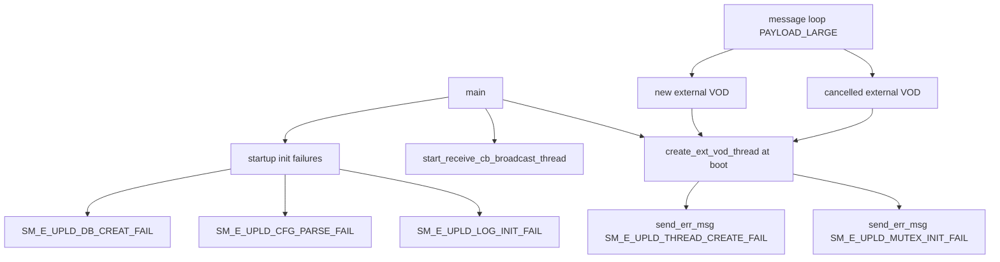

# Incoming Call Tree for create_ext_vod_thread and Startup Critical Emitters (uploader)

## Scope

Primary target:

- uploader/src/uploader.cpp:5293
  - bool create_ext_vod_thread()

Supporting startup emitter context:

- uploader/src/uploader.cpp:5339
  - int main()

## Mermaid Flow

## Deterministic Text Call Tree

### Target function

- uploader/src/uploader.cpp:5293
  - bool create_ext_vod_thread()

### Direct callers

- uploader/src/uploader.cpp:5625
  - `main()` bootup path when pending external VOD requests exist
- uploader/src/uploader.cpp:5977
  - message loop `PAYLOAD_LARGE` path for cancelled external VOD
- uploader/src/uploader.cpp:6037
  - message loop `PAYLOAD_LARGE` path for new external VOD

### Sink inside target

- uploader/src/uploader.cpp:5299
  - mutex init fail -> `SM_E_UPLD_MUTEX_INIT_FAIL`
- uploader/src/uploader.cpp:5309
  - ext VOD thread create fail -> `SM_E_UPLD_THREAD_CREATE_FAIL`

### Additional startup emitter anchor

- uploader/src/uploader.cpp:5339
  - `main()` emits critical startup errors directly (log init, config parse, DB create, msgq/thread create)
