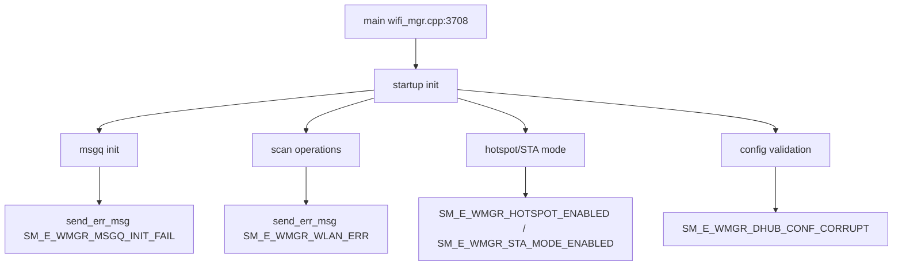

# Incoming Call Tree for WiFi Manager Main

## Scope

Primary entry:
- wifi_mgr/src/wifi_mgr.cpp:3708
  - int main()

## Mermaid Flow

## Deterministic Text Call Tree

### Entry

- wifi_mgr/src/wifi_mgr.cpp:3708
  - int main()

### Startup critical paths

- wifi_mgr.cpp:3742
  - msgq init fail -> `SM_E_WMGR_MSGQ_INIT_FAIL`
- wifi_mgr.cpp:3705
  - WiFi chip name info -> `SM_E_WMGR_WIFI_CHIP_NAME`
- wifi_mgr.cpp:406
  - wlan0 not found -> `SM_E_WMGR_WLAN_ERR`

### WiFi mode emission points

- wifi_mgr.cpp:2194
  - Hotspot creation fail -> `SM_E_WMGR_FAILED_HOTSPOT_ENABLED`
- wifi_mgr.cpp:2323
  - Hotspot enabled -> `SM_E_WMGR_HOTSPOT_ENABLED`
- wifi_mgr.cpp:2473
  - STA mode enabled -> `SM_E_WMGR_STA_MODE_ENABLED`
- wifi_mgr.cpp:2713
  - STA mode config done -> `SM_E_WMGR_STA_MODE_ENABLED`

### Config validation

- wifi_mgr.cpp:3432
  - DHUB config corrupt -> `SM_E_WMGR_DHUB_CONF_CORRUPT`
- wifi_mgr.cpp:2697
  - Empty scan result (automation) -> `SM_E_WMGR_SCAN_RESULT_EMPTY_AUTOMATION`
- wifi_mgr.cpp:3352
  - Auto config MDVR done -> `SM_E_WMGR_AUTO_CONFIG_MDVR_DONE`
